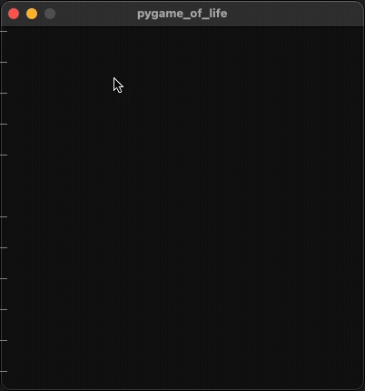

# pygame_of_life
An interactive simulator for [Conway's Game of Life](https://en.wikipedia.org/wiki/Conway%27s_Game_of_Life).
Written in Python, utilising PyGame for GUI.
The program uses no classes, and has minimal mutable state. The only mutable state is in the GUI.

## Demo

## Running
Run using `main.py -h <grid height>`.
The grid is a square grid of _grid_height * grid_height_ cells.
When launched the GUI is in drawing mode and clicking the left mouse will draw alive cells.
Pressing _c_ will clear the grid.
The simulation can be started and stopped using _Space_.
Pressing _Up_ or _Down_ makes the simulation faster or slower, respectively.
